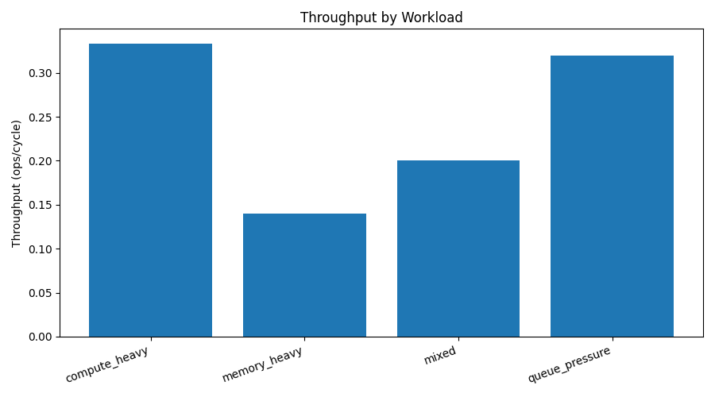
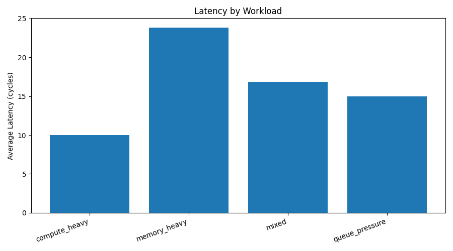
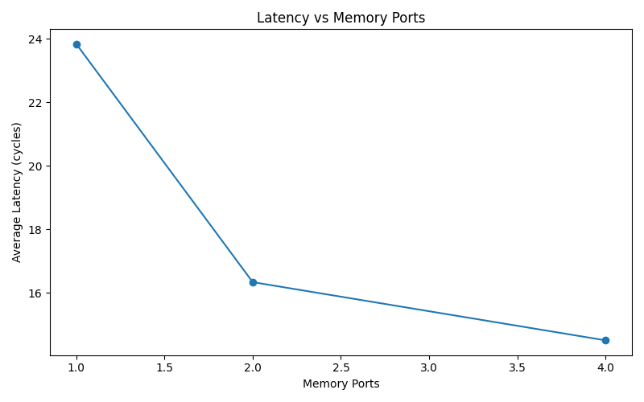
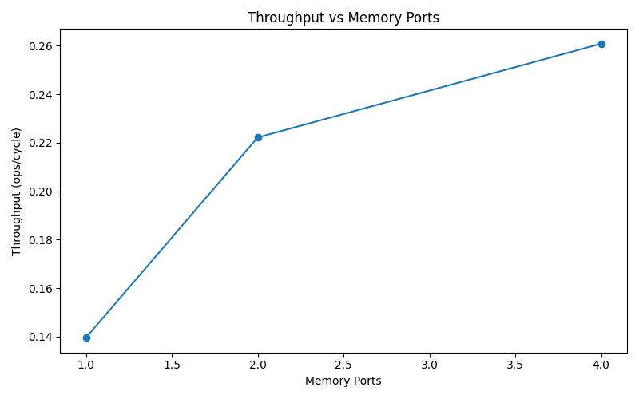
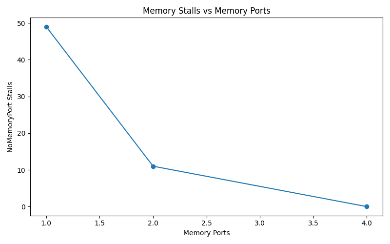

# AccelSim-Lite Performance Dashboard

## Summary

AccelSim-Lite is a deterministic workload-level accelerator simulator for analyzing throughput, latency, and bottleneck shifts under constrained compute and memory resources.

## Workload comparison

| Workload | Throughput | Avg Latency | Bottleneck | Classification |
|---|---:|---:|---|---|
| compute_heavy | 0.3333 | 10.0000 | WaitingDependency | dependency-bound |
| memory_heavy | 0.1395 | 23.8333 | NoMemoryPort | memory-bound |
| mixed | 0.2000 | 16.8333 | WaitingDependency | dependency-bound with memory pressure |
| queue_pressure | 0.3200 | 15.0000 | WaitingDependency | dependency-bound with compute contention |

## Derived metrics

- Throughput range: `0.1395–0.3333 ops/cycle`
- Latency range: `10.0–23.8333 cycles`
- Memory-heavy throughput drop vs compute-heavy: `58.15%`
- Memory-heavy latency increase vs compute-heavy: `2.38x`

## What-if memory sweep

Memory ports `1 → 4` on `memory_heavy`:

- Latency improvement: `39.16%`
- Throughput improvement: `87.03%`
- Bottleneck shift: `NoMemoryPort -> WaitingDependency`
- NoMemoryPort stall reduction: `49`

## Charts

## Interpretation

The simulator shows that memory bandwidth scaling improves performance until the memory bottleneck is removed. After that, dependency stalls dominate. This mirrors real performance engineering: optimization shifts the bottleneck rather than eliminating all bottlenecks.
